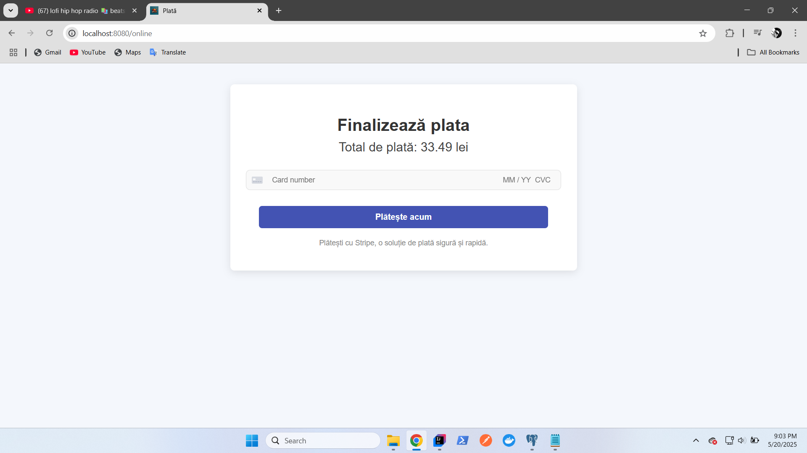

# YumDash 🍽️

🌐 [Youtube presentation for YumDash](https://youtu.be/LDUhtDXhFZ8)

**YumDash** is a web-based food delivery platform built using Spring Boot, Spring Security, and Thymeleaf. It allows users to browse restaurants, view menus, place orders, and manage their profiles.

---

## Features

- **User Authentication**: Log in or register to access personal profiles and order history.
- **Browse Restaurants**: Explore various food providers and their offers.
- **Order Management**: View past orders and their status.
- **Responsive Design**: Fully responsive design, optimized for desktop screens.
- **Admin Dashboard (optional)**: Admin users can manage restaurant listings and orders.

---

## Tech Stack

- **Backend**: Spring Boot
- **Authentication**: Spring Security
- **Template Engine**: Thymeleaf
- **Frontend**: Bootstrap
- **Database**: PostgreSQL (main), H2 (for integration testing)
- **Persistence**: JPA (Hibernate)
- **Code Simplification**: Lombok
- **Containerization**: Docker

---

## Screenshots

### Landing page
  
  
  

### Food page

### Cart

### Register / Login
  

### Food provider

### Provider view

### Admin

